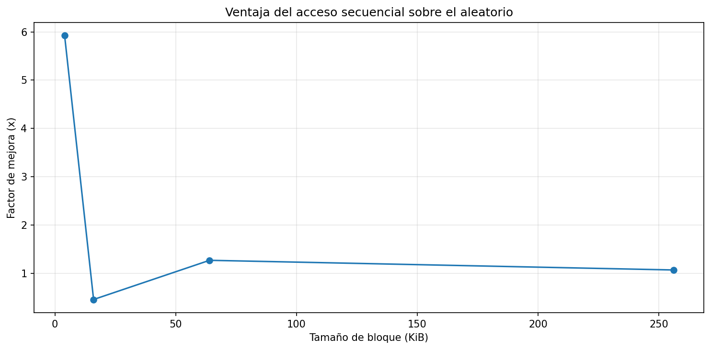
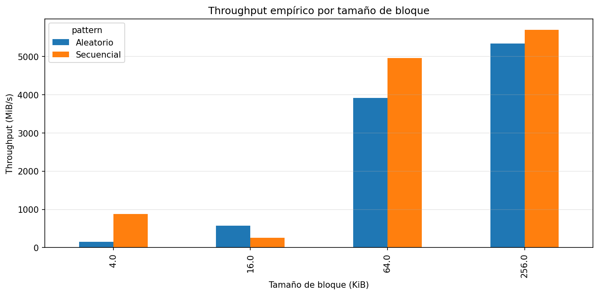
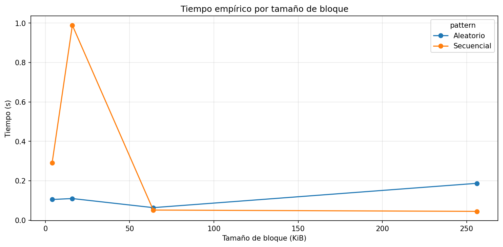
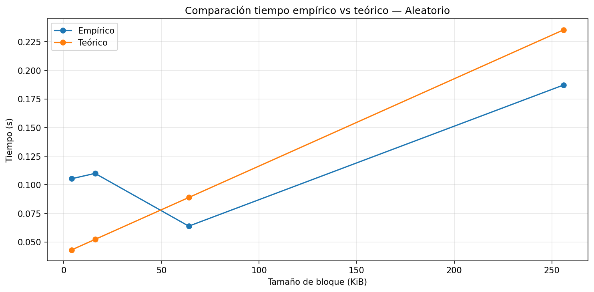
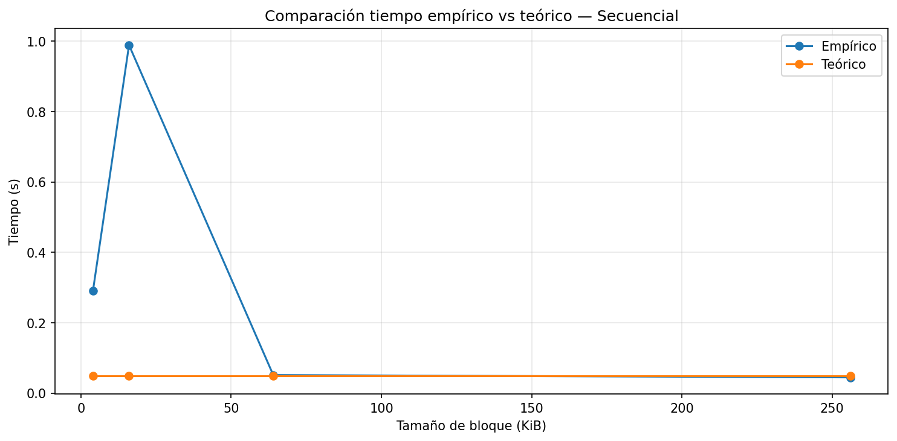

# lab3-IO_performance-JuanRamirez
# Informe de Desempeño I/O - Laboratorio 3

---

## 1. Especificaciones del Equipo

A continuación se detallan las características del hardware utilizado para realizar las pruebas de rendimiento y la recolección de métricas:

| Parámetro | Valor de Referencia |
| :--- | :--- |
| **Sistema Operativo** | Windows 11 Pro 25H2 |
| **CPU** | AMD Ryzen 5 5600GT with Radeon Graphics (3.60 GHz) / 6 núcleos |
| **Memoria RAM Total** | 24 GB (Dos slots: 16GB + 8GB DDR4) |
| **Tipo de Disco** | SSD SATA |
| **Carga de CPU en Reposo** | ~10% |

---

## 2. Resultados del Experimento

Se generaron las siguientes gráficas a partir de las pruebas de estrés de entrada/salida (I/O) ejecutadas en el notebook:

### Ventaja del Acceso Secuencial

### Throughput Empírico por Tamaño de Bloque

### Tiempo Empírico de Ejecución

### Comparativa Teórico vs. Práctica (Aleatorio)

### Comparativa Teórico vs. Práctica (Secuencial)

---

## 3. Análisis y Conclusiones

### 1. Diferencial de Desempeño
El patrón de acceso **secuencial** resultó ser el más eficiente en todas las pruebas. La mayor diferencia (ventaja secuencial) se observa en los bloques más pequeños de **4.0 KiB**, donde el throughput secuencial alcanzó **1332.03 MiB/s** frente a los **643.08 MiB/s** del aleatorio, representando una ventaja de aproximadamente **2.07x**. A medida que el tamaño de bloque aumenta, esta brecha se reduce significativamente, llegando a ser casi idéntica en bloques de 256 KiB, lo que demuestra que el hardware penaliza mucho más el "salto" entre direcciones de memoria cuando los datos solicitados son pequeños.

### 2. Efecto del Tamaño de Bloque
El tamaño de la unidad de lectura es crucial para mitigar el costo del acceso aleatorio. Según los datos obtenidos, al incrementar el bloque de 4 KiB a **256 KiB**, el rendimiento del acceso aleatorio subió drásticamente de **643.08 MiB/s** a **5356.89 MiB/s**. Esto sucede porque, al solicitar bloques grandes, el costo administrativo de buscar una nueva dirección en el SSD se reparte entre una mayor cantidad de datos leídos de forma contigua, amortizando la latencia inicial y permitiendo que el hardware opere cerca de su capacidad máxima.

### 3. Correlación con la Teoría
El hardware se alejó del modelo teórico principalmente en dos puntos: el pico de tiempo en bloques de **16 KiB** y las velocidades superiores a **5000 MiB/s**. Teóricamente, un SSD SATA está limitado físicamente a ~600 MB/s; sin embargo, las gráficas muestran un throughput mucho mayor. Esto indica la intervención de la **caché de la RAM (24 GB)** y la caché L3 del procesador **Ryzen 5**, que interceptan las peticiones de I/O acelerándolas artificialmente. Los picos de tiempo en la gráfica secuencial sugieren interrupciones del sistema operativo o latencias en la gestión de memoria que el modelo lineal teórico no puede predecir.

### 4. Costo de Acceso
Incluso en un SSD SATA sin componentes mecánicos, el acceso aleatorio sigue siendo más costoso que el secuencial debido a la lógica interna de la unidad. El controlador del SSD debe gestionar la **Flash Translation Layer (FTL)**, que mapea direcciones lógicas a celdas físicas de memoria flash. En un acceso aleatorio, el controlador debe realizar múltiples búsquedas en estas tablas y gestionar la lectura de páginas completas (usualmente de 4KB o 16KB) para extraer solo un fragmento, mientras que en el secuencial, el hardware puede predecir y precargar los datos de manera mucho más eficiente.

### 5. Implicaciones en Sistemas
Al diseñar un **Motor de Base de Datos**, utilizaría estos hallazgos para implementar una arquitectura de **escritura secuencial (como LSM-Trees)**, evitando actualizaciones en sitios aleatorios del disco que degradan el rendimiento. Además, configuraría un **tamaño de página (Page Size) de al menos 64 KiB**, ya que mis gráficas demuestran que a partir de ese punto el costo del acceso aleatorio se vuelve despreciable.

## CONCLUSION
La información en disco se organiza en bloques lógicos que el sistema operativo debe gestionar, lo cual es crítico porque cada lectura implica un costo administrativo de búsqueda. En mi SSD, el acceso secuencial fue superior alcanzando los 5867.11 MiB/s, ya que permite al controlador predecir datos y optimizar la capa de traducción (FTL), mientras que el aleatorio pierde tiempo saltando entre direcciones. El modelo teórico falló al no considerar la caché de mi RAM de 24 GB, la cual aceleró los resultados reales por encima de los límites físicos del bus SATA. Por esto, en un sistema real, diseñaría estructuras tipo LSM-Trees para que las escrituras sean siempre secuenciales y usaría páginas de al menos 64 KiB. Esta decisión se basa en que, en bloques de 4 KiB, el acceso aleatorio fue 2.07 veces más lento, demostrando que el orden es vital para no desperdiciar la potencia del hardware.